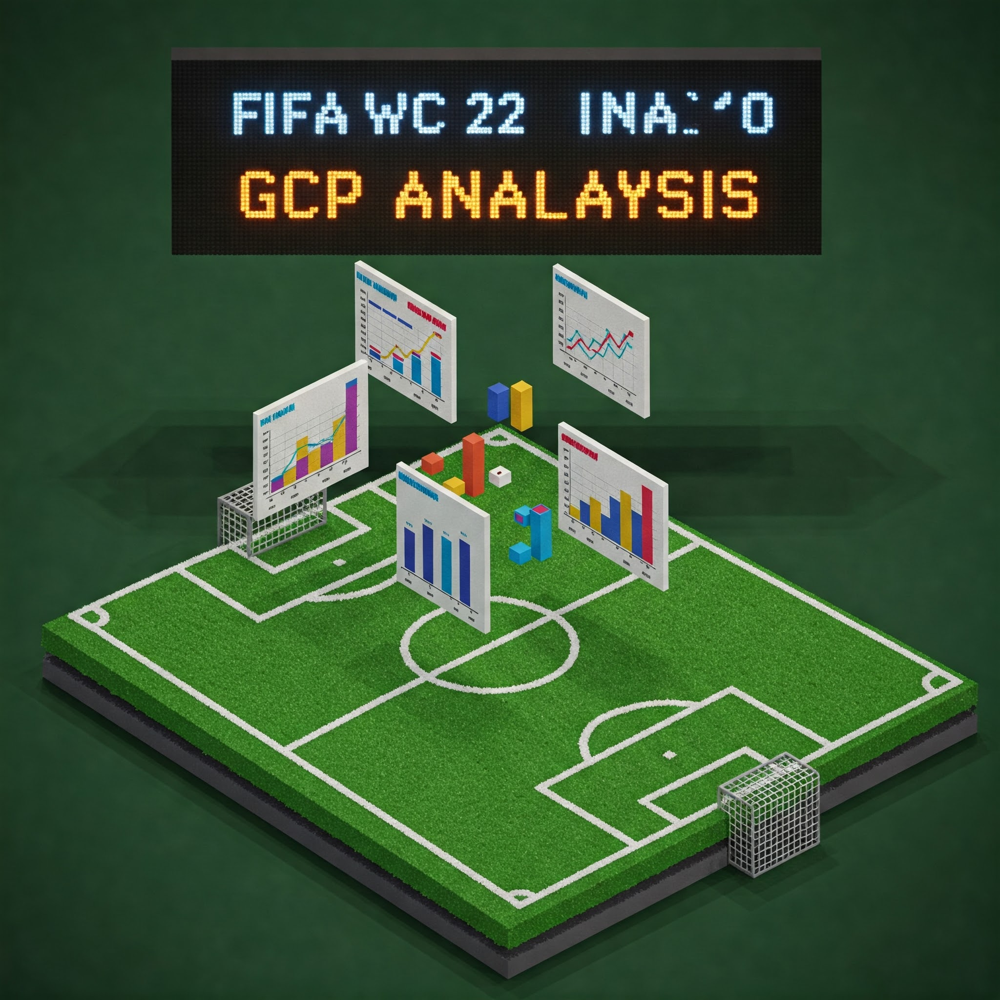

# FIFA World Cup 2022 Analysis Project

This project focuses on analyzing the FIFA World Cup 2022 dataset using Google Cloud Platform services, primarily Google BigQuery.

## Project Goal

The main objective is to ingest, analyze, and potentially model the FIFA World Cup 2022 dataset to derive insights about matches, players, and teams. This involves using BigQuery SQL for analysis, exploring BigQuery ML for modeling, and potentially leveraging Vertex AI for more advanced use cases like natural language querying and similarity searches.

## Repository Contents

*   `fifa_world_cup_gcp_plan`: A detailed plan outlining the project phases, from GCP setup and data ingestion to advanced analytics and application building.
*   `specifications/`: Directory containing data specifications and detailed schema definitions.
    *   `specifications-event-data.md`: Specification details for the event data.
    *   `specifications-tracking-data.md`: Specification details for the tracking data.
    *   `specifications-table_schemas.csv`: Raw CSV file defining the BigQuery table schemas used for data loading.
    *   `Table_schemas.md`: **Detailed markdown documentation of the BigQuery table schemas**, including expanded nested fields (STRUCTs/ARRAYs), derived from the CSV.
*   `basic-analysis.sql`: Contains foundational exploratory queries to provide initial insights into player performance, team progress, and overall data characteristics.
    *   **Included Queries:**
        *   Query 1: Total Event Count per Match
        *   Query 2: Players per Team
        *   Query 3: Match Details with Competition Info
        *   Query 4: Top 10 Goal Scorers
        *   Query 5: Team Match Results (Wins, Draws, Losses) - Overall
        *   Query 6: Top 10 Players by Successful Tackles
        *   Query 7: Top 10 Players by Successful Passes
        *   Query 8: Group Stage Standings (Points, W/D/L, GD, GF)
        *   Query 9: Top 10 Goalkeepers by Saves
*   `fantasy-analysis.sql`: Contains SQL queries focused on Fantasy Football relevant metrics.
    *   **Included Queries:**
        *   Query 1: Top Goal Scorers (Overall)
        *   Query 2: Top Goal Scorers (Midfielders)
        *   Query 3: Top Goal Scorers (Defenders)
        *   Query 4: Most Shots on Target (Overall)
        *   Query 5: Highest Pass Completion % (Midfielders, Min 100 Attempts)
        *   Query 6: Most Tackles Won (Defenders)
        *   Query 7: Most Tackles Won (Midfielders)
        *   Query 8: Most Saves (Goalkeepers)
        *   Query 9: Most Clean Sheets (Goalkeepers - Started)
        *   Query 10: Most Clean Sheets (Defenders - Started)
    *   **Relevance:** Addresses a common application of sports data, allowing analysis of fantasy league performance metrics.
*   `grades-analysis.sql`: Contains SQL queries focused on analyzing PFF player performance grades, if available in the dataset.
    *   **Included Queries:**
        *   Query 1: Average Passer Grade for Top Passers (by volume)
        *   Query 2: Average Shooter Grade for Top Shooters (by volume)
        *   Query 3: Highest Graded Individual Challenges
        *   Query 4: Average Shooter Grade: Goals vs. Non-Goals
        *   Query 5: Passer Grade Distribution
        *   Query 6: Average Passer Grade vs. Pass Outcome
        *   Query 7: Lowest Graded Individual Passes
        *   Query 8: Average Passer Grade per Team
        *   Query 9: Average Passer Grade by Position Group
        *   Query 10: Highest Average Passer Grade in a Single Match (Min 20 Passes)
    *   **Relevance:** Enables a deeper, potentially more nuanced evaluation of player and team performance beyond simple counts or outcomes, using PFF's grading system.
*   `bigqueryML.sql`: Contains SQL statements to create and test BigQuery ML models.
    *   **Included Models:**
        *   Model 1: Predict Match Outcome (Logistic Regression)
        *   Model 2: Cluster Players (K-Means)
        *   Model 3: Predict Goal Likelihood (Logistic Regression)
        *   Model 4: Classify Player Role (Logistic Regression)
    *   **Included Testing Queries:** Examples using `ML.EVALUATE`, `ML.CENTROIDS`, and `ML.PREDICT` for each model.
    *   **Relevance:** Demonstrates how to build predictive (classification) and descriptive (clustering) models directly within BigQuery using the dataset.
*   `conversational-analytics.sql`: Contains SQL statements to create BigQuery Views optimized for use with Looker Studio Conversational Analytics.
    *   **Included Views:**
        *   `vw_player_tournament_summary`: Aggregates player stats and includes a player similarity cluster ID (from `player_clusters_kmeans` BQML model).
    *   **Relevance:** Provides simplified, analysis-ready data sources suitable for natural language querying via Looker Studio.
*   `conversational-analytics-agent-conf.txt`: Contains configuration details (Name, Description, Instructions, Sample Questions) for a Looker Studio Data Agent.
    *   **Target View:** Designed for use with the `vw_player_tournament_summary` view.
    *   **Relevance:** Guides the Gemini model within Looker Studio to better understand the data context, terminology, and user intent, improving the quality of responses to natural language questions.

## Setup and Usage

1.  **GCP Setup:** Follow the steps outlined in the `fifa_world_cup_gcp_plan` document for setting up your Google Cloud project, enabling APIs (including Vertex AI for potential future use), and configuring permissions.
2.  **Data Loading:** Load the FIFA World Cup 2022 dataset into a BigQuery dataset named `fifa_world_cup_2022` within your GCP project (e.g., `awesome-advice-420021`). Ensure the table schemas match those defined in `specifications/specifications-table_schemas.csv`. Refer to `specifications/Table_schemas.md` for detailed explanations of the schemas.
3.  **Running Analysis & ML:** Execute the SQL in `basic-analysis.sql`, `fantasy-analysis.sql`, and `grades-analysis.sql` for data exploration. Run the `CREATE MODEL` statements in `bigqueryML.sql` to train the ML models (Note: incurs cost). Evaluate models using the testing queries provided.
4.  **Conversational Analytics Setup:**
    *   Run the `CREATE VIEW` statement(s) in `conversational-analytics.sql`.
    *   In Looker Studio Pro, connect to the created BigQuery view(s) (e.g., `vw_player_tournament_summary`) as a data source. [Ref](https://cloud.google.com/looker/docs/studio/conversational-analytics-bigquery)
    *   Configure the data source with user-friendly field names, descriptions, and aggregations.
    *   (Optional) Create a Data Agent using the configuration from `conversational-analytics-agent-conf.txt` to enhance the natural language query experience. [Ref](https://cloud.google.com/looker/docs/studio/conversational-data-agents)
    *   Use the Conversational Analytics feature to ask questions about the data (see sample questions in the agent config file).
    *   **Note 1:** The queries/models/views currently assume the dataset path is `awesome-advice-420021.fifa_world_cup_2022`. You may need to update the project ID in the SQL files to match your GCP project.
    *   **Note 2:** Running `CREATE MODEL` statements in `bigqueryML.sql` will initiate model training jobs and incur BigQuery processing costs.

## Data Source
The analysis relies on PFF FC's proprietary tracking and event data, which combines PFF event data with Sportlogiq broadcast tracking data. The data specification is detailed in the files within the `specifications/` directory, particularly in `Tracking-data.md` and `Event-data.md`. This includes synchronized game events, possession events, player tracking data, and performance grades.